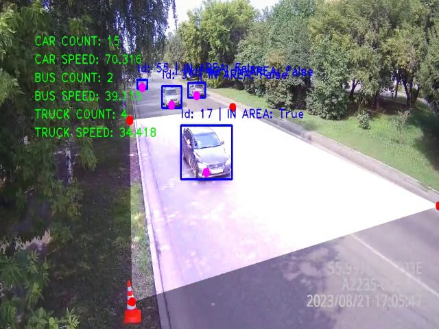

# Processing video recording of transport | hacks-ai-2023

Project for hacks-ai competition. The goal is to calculate average speed and count of some vehicles using video from camera.

<p>
    
</p>

#### Files:
 - run_predict_multiprocessing.py - script for parameters calculation
 - yolo-tracker-visualize.ipynb - ipython notebook for parameters calculation and visualizing result 

## Getting Started
```bash
git clone https://github.com/TheDenk/hacks-ai-2023.git
cd hacks-ai-2023

pip -r install requirements.txt
pip install -U nvidia-tensorrt --index-url https://pypi.ngc.nvidia.com
```

## Download model
Download model from [Google Drive](https://drive.google.com/file/d/1QUzwq-G2NEgH0jyWc_yvGRCKR6HqMewK/view?usp=drive_link) and put into project folder.

## Run command
```bash
CUDA_VISIBLE_DEVICES=0 python run_predict_multiprocessing.py \
    --start=0 \
    --end=50 \
    --n_jobs=5 \
    --model_path="path-to-yolo-model" \
    --video_folder="path-to-video-folder" \
    --json_folder="path-to-json-folder"
```

#### Parameters description:
```
--start - start file index  
--end - end file index  
--n_jobs - threads count  
--model_path - path-to-yolo-model  
--video_folder - path-to-video-folder  
--json_folder - path-to-json-folder  
```
  
## Autors
- <a href="https://github.com/thedenk">Karachev Denis</a>
- <a href="https://github.com/lolpa1n">Smolin Ilya</a>
- <a href="https://github.com/Gabijke">Isakov Maksim</a>
- <a href="https://github.com/licksylick">Lyskov Roman</a>
